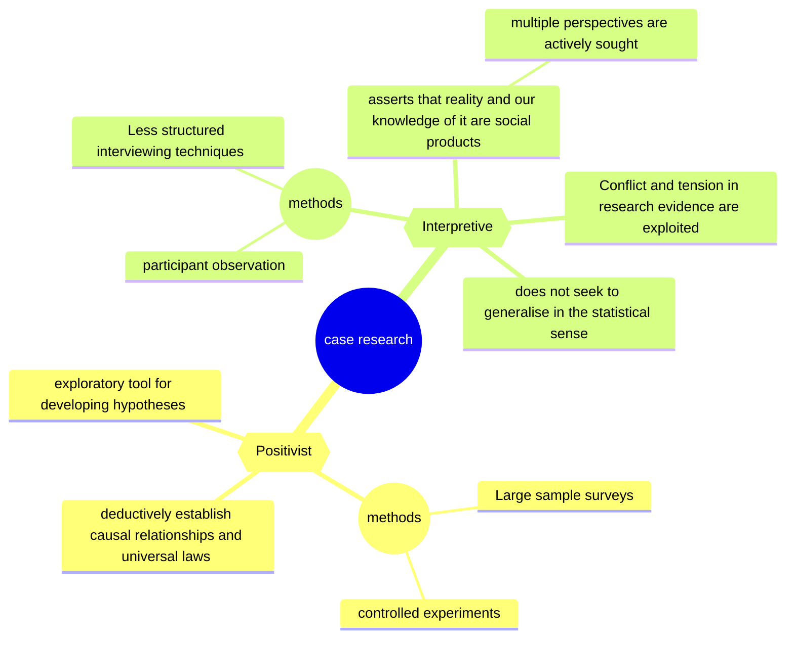

# ALTERNATIVE VIEWS OF CASE RESEARCH IN INFORMATION SYSTEMS

Author: Kill Doolin
Published: 1996

Mindmap

- Case studies are becoming increasingly popular in information systems (IS) research
- Such studies enable an examination of the interrelationship of information technologies with organisational activities and management practices
- Case research is the study of social practices in the field of activity in which they take place
  - the implication here is that the phenomenon under study is investigated within its "real-life context"
  - Experiments and surveys are thus excluded from this definition
- This close involvement with the organisation means that interviews and direct observations of activities tend to be the primary means of data collection in case research.

- Single case studies allow in-depth analysis of one setting
  - allowing a broad and detailed analysis of organisational dynamics, and the production of the rich descriptions favoured by interpretive researchers
- A multiple case design usually sacrifices detail and richness of description for the opportunity to make comparisons across several settings. Multiple case designs are necessary for generating generalisable theory under the replication logic of positivist case research
- The positivist assumption of an objective, measurable reality, with fixed causal relationships, encourages the use of more structured interviews to collect data for relevant variables.

---  

## Positivist research philosophy
- dominates IS research
- presupposes a reality which exists independently of our knowledge of it.
- understands organisations as having a structure and reality beyond the actions of its
members.
- This objective structure is capable of being discovered and measured
  - The validity and reliability of these identifying and measuring instruments is of particular concern
  - as is the passive, neutral role played by the researcher in the investigation
- participants in the research are required to express their experiences in terms of the researcher's constructs
- researchers in this tradition tend to assign case studies a preliminary role in developing measurement constructs or as an exploratory tool for developing hypotheses for subsequent, more rigorous, investigation
- Large sample surveys and controlled
experiments are primarily used, to deductively establish causal relationships and universal laws which form the
basis of generalised knowledge, and from which patterns of behaviour can be predicted across a range of situations.
- The positivist assumption of an objective, measurable reality, with fixed causal relationships, encourages the use of more structured interviews to collect data for relevant variables.
- a positivist epistemology itself becomes a subjectively selected "lens" through which the world is viewed. Researchers need to understand the implications of their research perspective
- Methodologies informed by a positivist research philosophy tend to treat case research as an exploratory tool for developing hypotheses in the construction of "scientific" theory
- The most common purpose given in the positivist studies was exploratory.
- a positivist epistemology itself becomes a subjectively selected "lens" through which the world is viewed. 
  - Researchers need to understand the implications of their research perspective
  - and be open to the possibilityof other research traditions
- Methodologies informed by a positivist research philosophy tend to treat case research as an exploratory tool for developing hypotheses in the construction of "scientific" theory.

## Interpretive research philosophy
- Emerging in IS research (when paper was published)
- asserts that reality and our knowledge of it are social products which cannot be understood independent of the social actors who construct and make sense of that reality.
  - A shared social reality is produced and reproduced through ongoing social interaction, and can only be interpreted, rather than "discovered"
  - Through this process of continuous social interaction, meanings and norms become objectively (intersubjectively) real
- a less strongly structured approach to the case researchis encouraged
  - favouring ethnographic techniques and participant observation as principal modes of data collection
- in the socially-constructed, subjective reality of the interpretive tradition no one perspective is more valid than another
  - multiple perspectives are actively sought by interviewing participants who span the organisation's hierarchic levels
  - Conflict and tension in research evidence are exploited to reveal differing aspects of the phenomenon
- Interpretive research does not seek to generalise in the statistical sense
  - Instead, a deeper understanding of the phenomenon is sought, which can then be used to inform other settings
- interpretive methodologies give a more central role to case research, utilising case studies to obtain a deeper understanding of the phenomenon and of the meaning of human behaviour.
- The studies reviewed which had their primary motivation in interpretation attempted to describe, interpret and understand IS phenomena, often utilising an alternative perspective to the technical or "rational" view of the mainstream, positivist tradition

---

# 