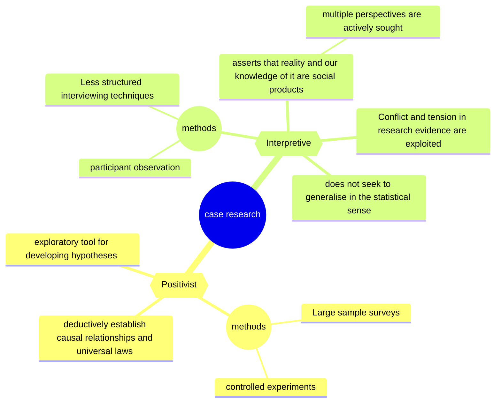

# ALTERNATIVE VIEWS OF CASE RESEARCH IN INFORMATION SYSTEMS

Author: Kill Doolin
Published: 1996

Mindmap

- Case studies are becoming increasingly popular in information systems (IS) research
- 

## Positivist
- dominates IS research
- presupposes a reality which exists independently of our knowledge of it.
- understands organisations as having a structure and reality beyond the actions of its
members.
- This objective structure is capable of being discovered and measured
  - The validity and reliability of these identifying and measuring instruments is of particular concern
  - as is the passive, neutral role played by the researcher in the investigation
- Large sample surveys and controlled
experiments are primarily used, to deductively establish causal relationships and universal laws which form the
basis of generalised knowledge, and from which patterns of behaviour can be predicted across a range of situations.
- The positivist assumption of an objective, measurable reality, with fixed causal relationships, encourages the use of more structured interviews to collect data for relevant variables.
- a positivist epistemology itself becomes a subjectively selected "lens" through which the world is viewed. Researchers need to understand the implications of their research perspective
- Methodologies informed by a positivist research philosophy tend to treat case research as an exploratory tool for developing hypotheses in the construction of "scientific" theory

## Interpretive
- Emerging in IS research (when paper was published)
- An interpretive research philosophy asserts that reality and our knowledge of it are social products which cannot be understood independent of the social actors who construct and make sense of that reality.
- in the socially-constructed, subjective reality of the interpretive tradition no one perspective is more valid than another
- multiple perspectives are actively sought by interviewing participants who span the organisation's hierarchic levels
- Less structured interviewing techniques are used
- Conflict and tension in research evidence are exploited to reveal differing aspects of the phenomenon
- Interpretive research does not seek to generalise in the statistical sense
- interpretive methodologies give a more central role to case research, utilising case studies to obtain a deeper understanding of the phenomenon and of the meaning of human behaviour.