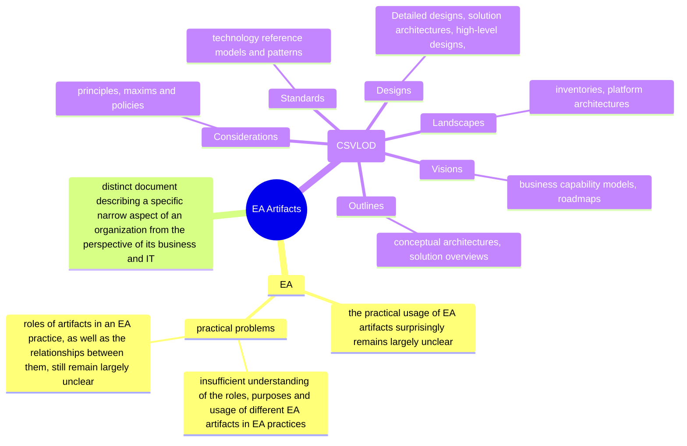
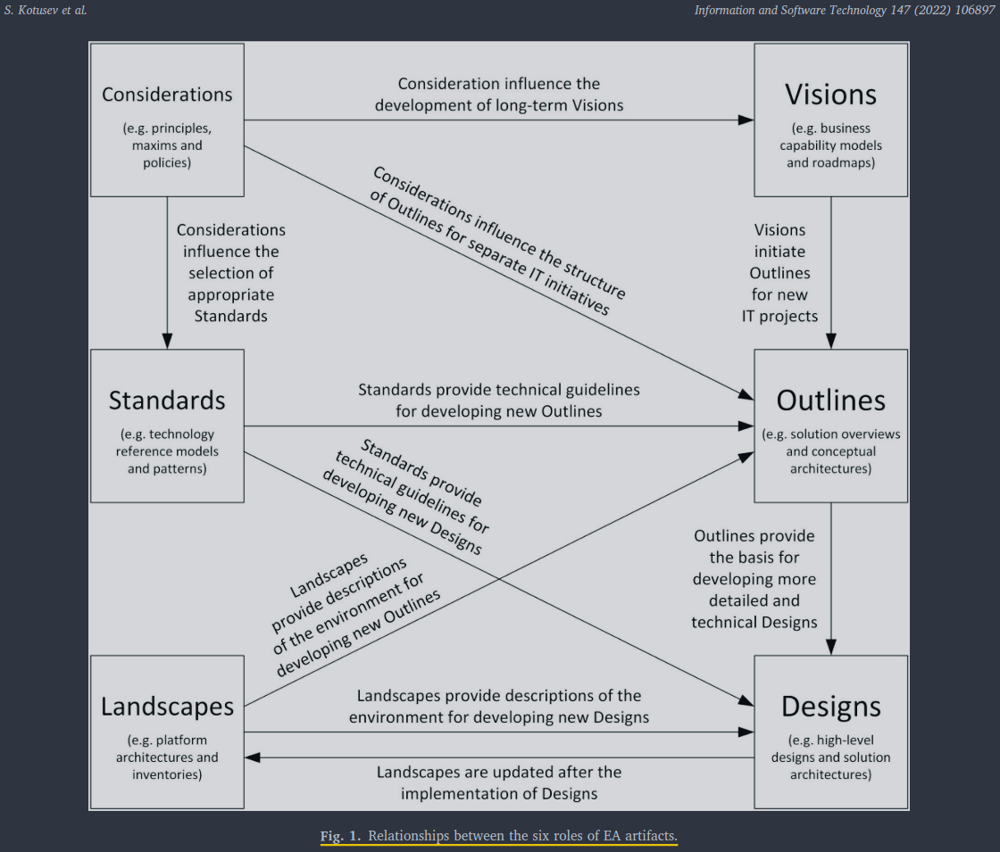

# The practical roles of enterprise architecture artifacts: A classification and relationship

Kotusev et al., 2022

- to realize the full potential value of IT investments, the IT strategy of a company should be aligned with its business strategy
- Enterprise architecture (EA) is a description of an enterprise from an integrated business and IT perspective intended to bridge the communication gap between business and IT stakeholders.

## Problem statement
- the practical usage of EA artifacts surprisingly remains largely unclear
- the most significant reported practical problems associated with EA can be partly attributed specifically to an insufficient understanding of the roles, purposes and usage of different EA artifacts in EA practice

## EA artifacts
- An EA artifact is a distinct document describing a specific narrow aspect of an organization from the perspective of its business and IT
- an incomplete list of EA artifacts that can be used to constitute EA includes:
  - context diagrams
  - principles, policies
  - standards
  - guidelines
  - business process models
  - business service views
  - information components
  - logical data models
  - data flow diagrams
  - system integration views
  - network diagrams
  - transition plans
  - roadmaps,
  - ...as well as a multitude of other artifacts
- The EA literature describes multiple ways of classifying EA artifacts based on their properties along different orthogonal dimensions, including:
  - domains
  - viewpoints
  - states
  - perspectives
  - interrogatives
  - abstraction levels
  - representations

---

---

The grounded theory analysis shows that all the identified EA artifacts can be classified based on their conceptual differences and similarities into six consistent groups describing their roles in an EA practice: 

