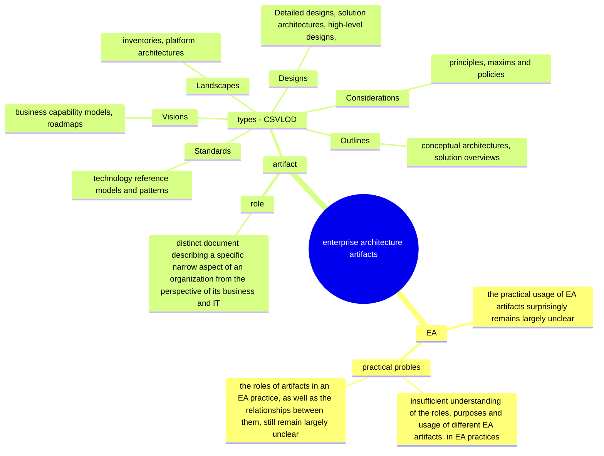

# The practical roles of enterprise architecture artifacts: A classification and relationship

Mindmap

```mermaid
mindmap
  root((enterprise architecture artifacts))
    EA
        the practical usage of EA artifacts surprisingly remains largely unclear
        practical probles 
            insufficient understanding of the roles, purposes and usage of different EA artifacts  in EA practices
            the roles of artifacts in an EA practice, as well as the relationships between them, still remain largely unclear
    artifact
        role
            distinct document describing a specific narrow aspect of an organization from the perspective of its business and IT
        types - CSVLOD
            Considerations
                principles, maxims and policies
            Standards
                technology reference models and patterns
            Visions
                business capability models, roadmaps
            Landscapes
                 inventories, platform  architectures
            Outlines
                conceptual architectures, solution overviews
            Designs  
                Detailed designs, solution architectures, high-level designs,
```

